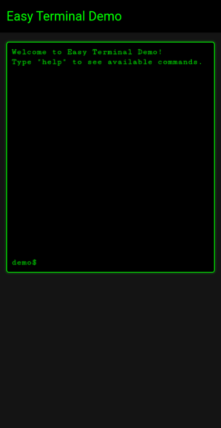
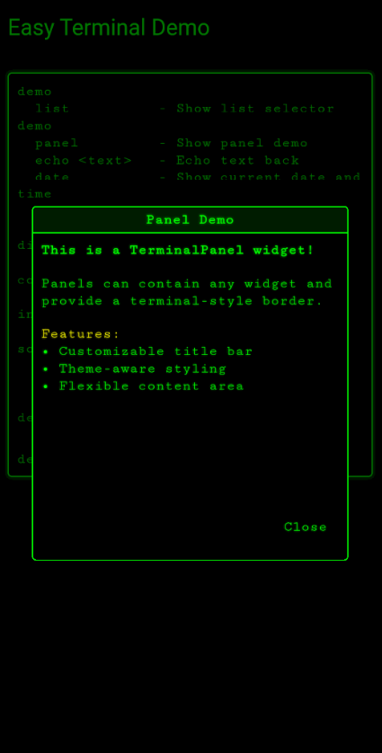
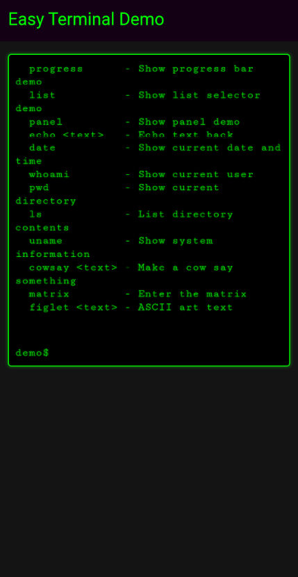
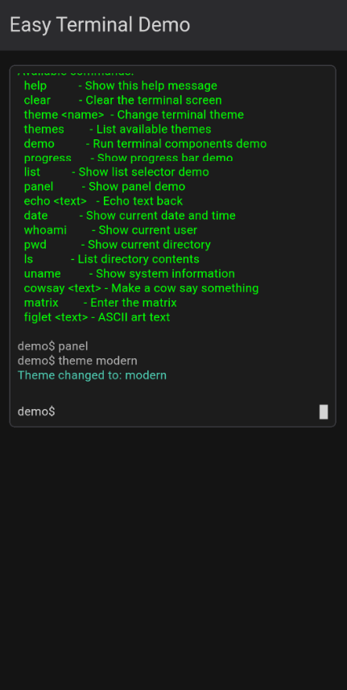

# Easy Terminal

A fully customizable terminal-style UI toolkit for Flutter that brings the power and aesthetics of command-line interfaces to your mobile and desktop applications.

[](https://pub.dev/packages/easy_terminal)
[](https://opensource.org/licenses/MIT)
[](https://flutter.dev)


## Usage Examples

These screenshots demonstrate the practical implementation of the package features:

- **Responsive Design**: The interface adapts well to different screen sizes
- **User Experience**: Clean, intuitive navigation and interaction patterns
- **Feature Integration**: Seamless integration of package functionality within the demo app
- **Customization**: Various configuration options available to developers


### Feature Demonstrations

<table>
<tr>
<td align="center">

<br>
<em>Main application interface showing the primary features and layout</em>
</td>
<td align="center">

<br>
<em>Demonstration of key package functionality in action</em>
</td>
<td align="center">

<br>
<em>Additional feature showcase highlighting package capabilities</em>
</td>
  <td align="center">

<br>
<em>Configuration interface demonstrating package customization options</em>
</td>
</tr>
</table>


## Getting Started

To integrate similar functionality in your own project, refer to the package documentation on pub.dev and use these screenshots as reference for expected behavior and UI patterns.


## Features

- **Terminal View** - Complete terminal emulation with command input, output display, and history
- **Input Components** - Advanced terminal-style input fields with autocomplete and command history
- **List Selectors** - Interactive terminal-style selection menus with keyboard navigation
- **Progress Bars** - ASCII-style progress indicators with customizable styling
- **Panels** - Bordered containers with optional titles for organizing terminal content
- **Themes** - Comprehensive theming system with support for colors, fonts, effects, and styling
- **Command Parsing** - Built-in command parser with support for arguments and flags
- **Keyboard Handling** - Full keyboard support including history navigation, shortcuts, and special keys
- **Box Drawing** - Extensive collection of Unicode box drawing characters and utilities
- **Visual Effects** - Optional scanlines, glow effects, and retro styling

## Use Cases

This package is perfect for:

- **Developer Tools** - Build CLI-style interfaces for development tools, debuggers, and IDEs
- **System Monitoring** - Create dashboards with terminal aesthetics for server monitoring
- **Games** - Develop retro-style games, hacking simulators, or text-based adventures
- **Educational Apps** - Build interactive coding tutorials or command-line learning tools
- **Admin Panels** - Design system administration interfaces with terminal styling
- **Data Entry** - Create efficient forms with terminal-style input and navigation
- **IoT Interfaces** - Build control panels for embedded systems and IoT devices
- **Prototyping** - Quickly mock up CLI tools and terminal applications

## Installation

Add this to your package's `pubspec.yaml` file:

```yaml
dependencies:
  easy_terminal: ^0.0.1
```

Then run:

```bash
flutter pub get
```

## Quick Start

### Basic Terminal View

```dart
import 'package:flutter/material.dart';
import 'package:easy_terminal/easy_terminal.dart';

class MyTerminal extends StatefulWidget {
  @override
  _MyTerminalState createState() => _MyTerminalState();
}

class _MyTerminalState extends State<MyTerminal> {
  final GlobalKey<TerminalViewState> _terminalKey = GlobalKey<TerminalViewState>();

  final TerminalTheme theme = TerminalTheme(
    backgroundColor: Color(0xFF000000),
    foregroundColor: Color(0xFF00FF00),
    cursorColor: Color(0xFF00FF00),
    fontFamily: 'Courier New',
    fontSize: 14.0,
  );

  @override
  Widget build(BuildContext context) {
    return Scaffold(
      body: TerminalView(
        key: _terminalKey,
        theme: theme,
        prompt: 'user@system:~\$ ',
        onCommand: _handleCommand,
        initialText: [
          'Welcome to Easy Terminal!',
          'Type "help" for available commands.',
        ],
      ),
    );
  }

  void _handleCommand(TerminalCommand command) {
    switch (command.command.toLowerCase()) {
      case 'help':
        _terminalKey.currentState?.addOutput(
          'Available commands:\n'
          '  help - Show this help message\n'
          '  clear - Clear the screen\n'
          '  echo <text> - Echo text back\n'
          '  date - Show current date',
        );
        break;
      case 'clear':
        _terminalKey.currentState?.clearScreen();
        break;
      case 'echo':
        _terminalKey.currentState?.addOutput(command.args.join(' '));
        break;
      case 'date':
        _terminalKey.currentState?.addOutput(DateTime.now().toString());
        break;
      default:
        _terminalKey.currentState?.addOutput(
          'Command not found: ${command.command}',
          color: theme.errorColor,
        );
    }
  }
}
```

### Terminal Input with Autocomplete

```dart
TerminalInput(
  theme: theme,
  prompt: 'Enter command: ',
  placeholder: 'Type a command...',
  suggestions: ['help', 'clear', 'echo', 'date', 'exit'],
  onSubmitted: (input) {
    print('Command entered: $input');
  },
  enableHistory: true,
)
```

### List Selector

```dart
TerminalListSelector<String>(
  items: ['Option 1', 'Option 2', 'Option 3', 'Option 4'],
  theme: theme,
  title: 'Select an option:',
  onSelected: (item, index) {
    print('Selected: $item at index $index');
  },
  showNumbers: true,
  selectedIndicator: '▶ ',
  unselectedIndicator: '  ',
)
```

### Progress Bar

```dart
TerminalProgressBar(
  progress: 0.75,
  theme: theme,
  label: 'Loading...',
  width: 40,
  showPercentage: true,
  fillChar: '█',
  emptyChar: '░',
)
```

### Themed Panel

```dart
TerminalPanel(
  title: 'System Information',
  theme: theme,
  child: Column(
    crossAxisAlignment: CrossAxisAlignment.start,
    children: [
      TerminalText(text: 'CPU: 45%', theme: theme),
      TerminalText(text: 'Memory: 2.1GB / 8GB', theme: theme),
      TerminalText(text: 'Disk: 156GB / 512GB', theme: theme),
    ],
  ),
)
```

## Theming

Easy Terminal provides extensive theming capabilities:

```dart
final customTheme = TerminalTheme(
  backgroundColor: Color(0xFF1E1E1E),
  foregroundColor: Color(0xFF00D4AA),
  cursorColor: Color(0xFFFFFFFF),
  selectionColor: Color(0x4000D4AA),
  borderColor: Color(0xFF00D4AA),
  errorColor: Color(0xFFFF5555),
  successColor: Color(0xFF50FA7B),
  warningColor: Color(0xFFFFB86C),
  fontFamily: 'Fira Code',
  fontSize: 16.0,
  lineHeight: 1.4,
  enableScanlines: true,
  enableGlow: true,
  glowRadius: 2.0,
  borderRadius: 8.0,
  borderWidth: 2.0,
);
```

## Components Overview

### Core Components

| Component | Description |
|-----------|-------------|
| `TerminalView` | Complete terminal interface with command input/output |
| `TerminalInput` | Advanced input field with history and autocomplete |
| `TerminalText` | Styled text rendering with theme support |
| `TerminalPanel` | Bordered container for organizing content |
| `TerminalListSelector` | Interactive selection menu with keyboard navigation |
| `TerminalProgressBar` | ASCII-style progress indicators |

### Models

| Model | Purpose |
|-------|---------|
| `TerminalTheme` | Comprehensive theming configuration |
| `TerminalBuffer` | Text buffer management with scrolling |
| `TerminalCommand` | Command parsing with arguments and flags |
| `TerminalCursor` | Cursor state and positioning |

### Utilities

| Utility | Features |
|---------|----------|
| `KeyboardHandler` | Command history, keyboard shortcuts, special keys |
| `BoxDrawing` | Unicode box drawing characters and utilities |
| `ColorUtils` | Color manipulation and effects |

## Advanced Features

### Command Parsing

```dart
final command = TerminalCommand.parse('git commit -m "Initial commit" --verbose');
print(command.command); // 'git'
print(command.args); // ['commit']
print(command.flags); // {'m': 'Initial commit', 'verbose': 'true'}
```

### Box Drawing

```dart
// Create a box
final box = BoxDrawing.createBox(20, 10, doubleLine: true);

// Progress bar
final progress = BoxDrawing.createProgressBar(0.7, 30, 
  fillChar: BoxDrawing.fullBlock,
  emptyChar: BoxDrawing.lightShade,
);
```

### Buffer Management

```dart
final buffer = TerminalBuffer(maxLines: 1000);
buffer.addText('Hello, Terminal!');
buffer.addLine(TerminalLine(
  content: 'Error occurred',
  color: Colors.red,
  isInput: false,
));

// Get visible lines for display
final visibleLines = buffer.getVisibleLines(25);
```

## Keyboard Shortcuts

Easy Terminal supports standard terminal keyboard shortcuts:

- `Ctrl+C` - Clear current input
- `Ctrl+L` - Clear screen
- `Ctrl+D` - EOF signal
- `↑/↓` - Navigate command history
- `Tab` - Autocomplete suggestions
- `Esc` - Close suggestions/cancel
- `Enter` - Execute command
- `Backspace` - Delete character
- `Home/End` - Navigate to line start/end

## Examples

The package includes several example implementations:

1. **Basic Terminal** - Simple command-line interface
2. **File Manager** - Terminal-style file browser
3. **System Monitor** - Resource monitoring dashboard
4. **Code Editor** - Terminal-based text editor
5. **Game Terminal** - Interactive text adventure
6. **Developer Console** - Debug console for applications

## Performance Considerations

- Text rendering is optimized for large amounts of terminal output
- Buffer management automatically handles memory limits
- Keyboard input is debounced for smooth performance
- Themes support hardware acceleration for visual effects

## Platform Support

Easy Terminal works on all Flutter platforms:
- iOS
- Android  
- Web
- Windows
- macOS
- Linux

## Contributing

Contributions are welcome! Please read our contributing guidelines and submit pull requests to our GitHub repository.

## License

This project is licensed under the MIT License - see the [LICENSE](LICENSE) file for details.

## Changelog

See [CHANGELOG.md](CHANGELOG.md) for a detailed history of changes.

## Support

If you find this package helpful, please consider:
- Giving it a star on GitHub
- Reporting issues and bugs
- Contributing improvements
- Sharing it with other developers

For questions and support, please open an issue on our GitHub repository.